<div align="center">

<a href="https://github.com/VictorBasso36">
  
</a>

<br/>

[](https://www.linkedin.com/in/victor-basso-b3090a189/)
[](mailto:victorbassodev@gmail.com)
[](https://api.whatsapp.com/send/?phone=5511999978633&text=Ol%C3%A1%21+Aqui+%C3%A9+o+Victor+Basso%2C+engenheiro+de+software.+Estou+dispon%C3%ADvel+para+conversar+sobre+seus+projetos.&type=phone_number&app_absent=0)

</div>


<div align="center">

### 🌎 Read in your language &nbsp;·&nbsp; Leia no seu idioma

**Click a flag below to expand** &nbsp;·&nbsp; **Clique em uma bandeira para expandir**

</div>

<details open>
<summary><h3>🇺🇸&nbsp; English</h3></summary>

<br/>

### 👋 About me

I'm a **Senior Software Engineer** with a **generalist** profile, currently working as a **Tech Lead**. I don't stop at the boundary of a single layer: I design, build, ship and operate **end-to-end solutions** — from the first conversation about the problem, through architecture and code, all the way to infrastructure, deployment and production.

Leading a team gave me depth in **system design and technical leadership**, but I stayed **hands-on**. Today a big part of my work is bringing **AI agents and automation into the software lifecycle** — accelerating delivery without giving up architectural quality.

```yaml
role:      Senior Software Engineer (Generalist) · Tech Lead
based in:  São Paulo, Brazil
delivery:  end-to-end — discovery → architecture → code → infra → production
strengths: [ backend, frontend, cloud, IaC, AI engineering, product thinking ]
mindset:   own the problem, not just the ticket
```

### 🚀 What I deliver

| | |
|---|---|
| 🧠 **Architecture & Design** | Scalable, resilient and pragmatic systems — built to evolve, not just to pass the demo. |
| ⚙️ **Backend Engineering** | APIs, serverless microservices, event-driven flows, relational and NoSQL data modeling. |
| 🎨 **Frontend Engineering** | Modern, accessible and fast interfaces with real attention to UX. |
| ☁️ **Cloud & Infrastructure** | GCP, AWS and Azure with **Terraform**, Docker and CI/CD — reproducible, versioned, reviewed as code. |
| 🤖 **AI Engineering** | Autonomous agents, tool calling, RAG, orchestration and AI-driven development workflows. |
| 🧭 **Technical Leadership** | Tech Lead: technical direction, code review, mentoring and delivery aligned with business value. |
| 🛠️ **Product & Hardware** | 3D modeling in **Fusion 360** when the solution goes beyond the screen. |

### 🤖 AI-driven development

I don't just *use* AI — I **build with it and for it**:

- **Autonomous agents** with tools, memory and orchestrated multi-step execution
- **AI-assisted engineering**: spec-driven development, automated review, agentic pipelines
- **RAG & context engineering**: embeddings, vector stores, retrieval and evaluation
- **LLM integration**: streaming, structured output, cost control and observability

> Modern software engineering takes more than code — it takes the ability to orchestrate AI tooling to speed up delivery without losing architectural quality.

### 🎓 Education & certifications

- **FIAP** — Technology Degree in Systems Analysis and Development *(2024 — 2026)*
- **ETEC** — Technical Degree in Web Programming *(2019 — 2021)*
- **Google Cloud** — Certified Partner Specialist: *Gemini Enterprise Agent Development*
- **Google Cloud** — Certified Partner Specialist: *Gemini Enterprise Deployment*
- **FIAP** — Leadership Communication

### 💬 Let's talk

Got an idea, a stalled project or a problem nobody wants to own? **Send me a message** — I like the hard ones.

</details>

<details>
<summary><h3>🇧🇷&nbsp; Português</h3></summary>

<br/>

### 👋 Sobre mim

Sou **Engenheiro de Software Sênior** com perfil **generalista**, atualmente atuando como **Tech Lead**. Não paro na fronteira de uma única camada: eu desenho, construo, entrego e opero **soluções end-to-end** — da primeira conversa sobre o problema, passando por arquitetura e código, até infraestrutura, deploy e produção.

Liderar time me deu profundidade em **design de sistemas e liderança técnica**, mas mantive minha essência **hands-on**. Hoje boa parte do meu trabalho é levar **agentes de IA e automação para o ciclo de vida do software** — acelerando a entrega sem abrir mão da qualidade arquitetural.

```yaml
cargo:       Engenheiro de Software Sênior (Generalista) · Tech Lead
localização: São Paulo, Brasil
entrega:     end-to-end — discovery → arquitetura → código → infra → produção
forças:      [ backend, frontend, cloud, IaC, engenharia de IA, visão de produto ]
mentalidade: dono do problema, não apenas da tarefa
```

### 🚀 O que eu entrego

| | |
|---|---|
| 🧠 **Arquitetura & Design** | Sistemas escaláveis, resilientes e pragmáticos — feitos para evoluir, não apenas para passar na demo. |
| ⚙️ **Engenharia Backend** | APIs, microsserviços serverless, fluxos orientados a eventos, modelagem de dados relacional e NoSQL. |
| 🎨 **Engenharia Frontend** | Interfaces modernas, acessíveis e rápidas, com atenção real à experiência do usuário. |
| ☁️ **Cloud & Infraestrutura** | GCP, AWS e Azure com **Terraform**, Docker e CI/CD — reprodutível, versionado e revisado como código. |
| 🤖 **Engenharia de IA** | Agentes autônomos, tool calling, RAG, orquestração e desenvolvimento orientado a IA. |
| 🧭 **Liderança técnica** | Tech Lead: direção técnica, code review, mentoria e entrega alinhada ao valor de negócio. |
| 🛠️ **Produto & Hardware** | Modelagem 3D no **Fusion 360** quando a solução vai além da tela. |

### 🤖 Desenvolvimento orientado a IA

Eu não apenas *uso* IA — eu **construo com ela e para ela**:

- **Agentes autônomos** com ferramentas, memória e execução orquestrada em múltiplas etapas
- **Engenharia assistida por IA**: desenvolvimento guiado por especificação, revisão automatizada, pipelines agênticos
- **RAG & engenharia de contexto**: embeddings, bancos vetoriais, retrieval e avaliação
- **Integração com LLMs**: streaming, saída estruturada, controle de custo e observabilidade

> A engenharia de software moderna exige mais do que código — exige a capacidade de orquestrar ferramentas de IA para acelerar a entrega sem perder qualidade arquitetural.

### 🎓 Formação & certificações

- **FIAP** — Curso Superior de Tecnologia em Análise e Desenvolvimento de Sistemas *(2024 — 2026)*
- **ETEC** — Técnico em Programação Web *(2019 — 2021)*
- **Google Cloud** — Certified Partner Specialist: *Gemini Enterprise Agent Development*
- **Google Cloud** — Certified Partner Specialist: *Gemini Enterprise Deployment*
- **FIAP** — Leadership Communication

### 💬 Vamos conversar

Tem uma ideia, um projeto travado ou um problema que ninguém quer assumir? **Me manda uma mensagem** — eu gosto dos difíceis.

</details>


<div align="center">

## 🧰 Tech Stack

</div>

#### ⚙️ Backend

[](https://skillicons.dev)

#### 🎨 Frontend

[](https://skillicons.dev)

#### ☁️ Cloud, Infra & DevOps

[](https://skillicons.dev)

#### 🤖 AI Engineering &nbsp;·&nbsp; Engenharia de IA

<p>
  
  
  
  
  
  
  
</p>

#### 🛠️ CAD & Product &nbsp;·&nbsp; CAD & Produto

<p>
  
  
</p>

<div align="center">

### 📜 Certifications &nbsp;·&nbsp; Certificações


</div>


<div align="center">

## ⚡ Live activity &nbsp;·&nbsp; Atividade ao vivo

</div>



<div align="center">

<picture>
  <source media="(prefers-color-scheme: dark)" srcset="https://raw.githubusercontent.com/VictorBasso36/VictorBasso36/output/github-snake-dark.svg"/>
  <source media="(prefers-color-scheme: light)" srcset="https://raw.githubusercontent.com/VictorBasso36/VictorBasso36/output/github-snake.svg"/>
  
</picture>

<sub>🐍 my contribution grid, eaten daily by a snake rendered on GitHub Actions &nbsp;·&nbsp; meu grid de contribuições, devorado diariamente por uma cobra renderizada no GitHub Actions</sub>

<br/><br/>

**👇 Click a tab to open it &nbsp;·&nbsp; Clique em uma aba para abrir**

</div>

<details open>
<summary><b>&nbsp;📈&nbsp; Overview &nbsp;·&nbsp; Visão geral</b></summary>
<br/>
<div align="center">
<picture>
  <source media="(prefers-color-scheme: dark)" srcset="https://github-readme-stats.vercel.app/api?username=VictorBasso36&show_icons=true&hide_border=true&theme=tokyonight&include_all_commits=true&count_private=true&rank_icon=github"/>
  <source media="(prefers-color-scheme: light)" srcset="https://github-readme-stats.vercel.app/api?username=VictorBasso36&show_icons=true&hide_border=true&theme=default&include_all_commits=true&count_private=true&rank_icon=github"/>
  
</picture>
</div>
</details>

<details>
<summary><b>&nbsp;🧪&nbsp; Languages &nbsp;·&nbsp; Linguagens</b></summary>
<br/>
<div align="center">
<picture>
  <source media="(prefers-color-scheme: dark)" srcset="https://github-readme-stats.vercel.app/api/top-langs/?username=VictorBasso36&layout=compact&hide_border=true&theme=tokyonight&langs_count=10"/>
  <source media="(prefers-color-scheme: light)" srcset="https://github-readme-stats.vercel.app/api/top-langs/?username=VictorBasso36&layout=compact&hide_border=true&theme=default&langs_count=10"/>
  
</picture>
</div>
</details>

<details>
<summary><b>&nbsp;🔥&nbsp; Streak &nbsp;·&nbsp; Sequência</b></summary>
<br/>
<div align="center">
<picture>
  <source media="(prefers-color-scheme: dark)" srcset="https://streak-stats.demolab.com?user=VictorBasso36&hide_border=true&theme=tokyonight"/>
  <source media="(prefers-color-scheme: light)" srcset="https://streak-stats.demolab.com?user=VictorBasso36&hide_border=true&theme=default"/>
  
</picture>
</div>
</details>

<details>
<summary><b>&nbsp;📅&nbsp; Contribution graph &nbsp;·&nbsp; Gráfico de contribuições</b></summary>
<br/>
<div align="center">
<picture>
  <source media="(prefers-color-scheme: dark)" srcset="https://github-readme-activity-graph.vercel.app/graph?username=VictorBasso36&theme=tokyo-night&hide_border=true&area=true"/>
  <source media="(prefers-color-scheme: light)" srcset="https://github-readme-activity-graph.vercel.app/graph?username=VictorBasso36&theme=github-light&hide_border=true&area=true"/>
  
</picture>
</div>
</details>

<details>
<summary><b>&nbsp;🏆&nbsp; Trophies &nbsp;·&nbsp; Troféus</b></summary>
<br/>
<div align="center">
<picture>
  <source media="(prefers-color-scheme: dark)" srcset="https://github-profile-trophy.vercel.app/?username=VictorBasso36&theme=tokyonight&no-frame=true&no-bg=true&column=7&margin-w=8"/>
  <source media="(prefers-color-scheme: light)" srcset="https://github-profile-trophy.vercel.app/?username=VictorBasso36&theme=flat&no-frame=true&no-bg=true&column=7&margin-w=8"/>
  
</picture>
</div>
</details>


<div align="center">

## 🤝 Contact me &nbsp;·&nbsp; Fale comigo


<br/>

<a href="https://www.linkedin.com/in/victor-basso-b3090a189/">
  
</a>
<a href="mailto:victorbassodev@gmail.com">
  
</a>
<a href="https://api.whatsapp.com/send/?phone=5511999978633&text=Ol%C3%A1%21+Aqui+%C3%A9+o+Victor+Basso%2C+engenheiro+de+software.+Estou+dispon%C3%ADvel+para+conversar+sobre+seus+projetos.&type=phone_number&app_absent=0">
  
</a>

</div>


